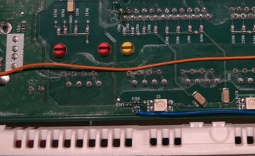
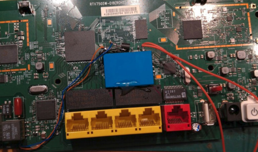

Temporary BBMS Front Door Access Control
========================================

This repo is for the temporary replacement front door access control for BBMS.

Apart from a specific USB 125kHz card reader, this software is mostly hardware
agnostic and should work on any kind of Linux system.

It's currently deployed on a recycled "Plusnet" home router which has been
reflashed with the [OpwnWRT](https://openwrt.org) embedded operating system.
However, it should work with minimal changes on a Raspberry Pi for example.

To reproduce the current hardware
---------------------------------

Any OpenWRT capable router with a decent about of flash (say >= 64MB) should
be adequate.

Follow [this link](https://openwrt.org/toh/bt/homehub_v5a) for details on how
to reflash a fresh unit of the same type used here.

Once set up with OpenWRT, a few extra packages need to be installed. This can
be done via the Web GUI, or from the command line via
[opkg](https://openwrt.org/docs/guide-user/additional-software/opkg) package
manager. Install the following: -

- bash
- wget
- grep
- netcat

The "Plusnet" box has no GPIO at all. However, it does have 9 LEDs and 3 push
buttons, which can mostly be tapped as digital inputs or outputs. I used the
signal for driving the red LED behind the "Broadband" legend to control the door
lock actuator as it isn't otherwise used for anything. The signal is 3.3V logic
and is "active low" (i.e. the LED is lit when the signal is at ground). It can
be tapped at the opposite side of resistor near the LED, thus (blue wire):

The door lock actuator is driven by relay contacts. The 12V relay coil is
controlled by the GPIO pin above with a simple transistor circuit which is
assembled directly onto the pins of the relay.

Software
--------

There are two parts to the software, the interface to the USB HID "input events"
Linux driver which is compiled C code, and the BBMS business logic which is
implemented as a BASH shell script. The two processes communicate by means of a
"named pipe" which carries a text representation of the key fob number when the
reader is tapped. The HID events are translated to ASCII digits by the compiled
program which feeds the pipe, and the shell script reads strings from the pipe
and processes them.

The script, _rfid-lock.bash.sh_ loops forever, but if nothing has been read from
the pipe for 15 minutes, it contacts the BBMS server to provide it with a
"heartbeat" message before continuing to wait.

Cross compile the C code for the target processor using the appropriate
OpenWRT SDK. For example, the HomeHub 5A SDK can be found [here](https://downloads.openwrt.org/releases/21.02.3/targets/lantiq/xrx200/).
[(direct link)][https://downloads.openwrt.org/releases/21.02.3/targets/lantiq/xrx200/openwrt-sdk-21.02.3-lantiq-xrx200_gcc-8.4.0_musl.Linux-x86_64.tar.xz]

For example, if the SDK linked above is extracted to the parent directory, the
following command can be used to cross compile the program:

	STAGING_DIR=../openwrt-sdk-21.02.3-lantiq-xrx200_gcc-8.4.0_musl.Linux-x86_64/staging_dir \
	../openwrt-sdk-21.02.3-lantiq-xrx200_gcc-8.4.0_musl.Linux-x86_64/staging_dir/toolchain-mips_24kc_gcc-8.4.0_musl/bin/mips-openwrt-linux-gcc \
	grab-hid.c -o grab-hid

Another script, _watch-reader.sh_ is used to set up the named pipe and restart
both processes if either one crashes or exits.

Copy the resulting binary, _grab-hid_, together with the scripts to the embedded
system, e.g. using scp. Add a line to _/etc/rc.local_ to start _watch-reader.sh_
when the system starts up.

RFID Key Codes
--------------

The USB RFID reader provides only a decimal representation of the key fob's
unique ID. However, the transaction between reader and RFID device also includes
some extra information: a vendor ID for the fob and a checksum. Some other
types of RFID reader provide this extra information, and BBMS uses the
complete record for user identification.

The checksum can be trivially computed, but unfortunately the vendor ID is
not available from the USB device. The script attempts to figure out the
vendor ID by testing several from a list in turn against BBMS. When is finds
a working combination, it stores the record against the fob's unique ID so that
in the future it can check it with BBMS immediately.

The list of candidate vendor IDs is embedded in the script as a variable called
_PREFIXES_. This list can be generated by scraping the admin portal of BBMS and
a utility _scrape.sh_ is included for that purpose.

To use _scrape.sh_, you must have an admin on BBMS. Log into BBMS with a browser
and export your session cookies to a file called _cookies.txt_. After copying
this file to the repo's root directory, run _scrape.sh_.

	sh ./scrape.sh

The output is a list of the unique key fob vendor ID prefixes sorted by
popularity. It can be copied and pasted directly into _rfid-lock.bash.sh_,
replacing the existing string assigned to _PREFIXES_.
